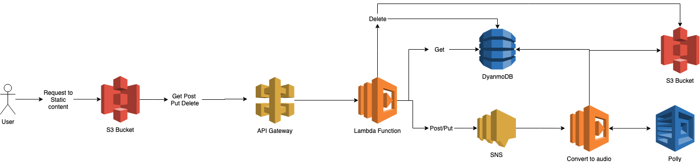

This is the code used for my Light Novel website at http://s3.amazonaws.com/poly-website-lab.

Go to /novels.html for the latest and /dev.html for updating text you would like to copy and paste.

to zip up the lambda use

zip -r9 

Infrastructure:

This infrastructure consistes of of <> main components:

Front End - Static Website:
The front end is a simple static website using HTML, CSS, and Javascript to display the data stored in an S3 bucket and to update the data using the API Gateway endpoint. 

Back End - AWS (Lambda, Poly, S3, SNS, DynamoDB, Cloudwatch, API Gateway), Python, BeautifulSoup4, and boto3:
The Back end is built using AWS for its entire infrastructure with a python codebase. 

Diagram of the architecture below:

